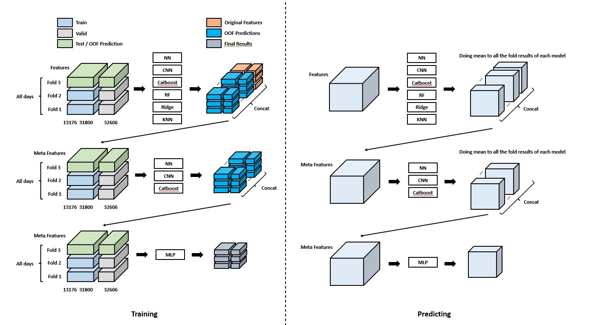

# 🥇 4th Place Solution for  Open Problems - Multimodal Single-Cell Integration


## Results

- Private: 0.773145, 4th place
- Public: 0.813093

## Solution

* You may find more detailed explanation [here](https://www.kaggle.com/competitions/open-problems-multimodal/discussion/366460) 

### Ⅰ. Cite

#### 1. Data preprocessing 

* `np.log1p`

#### 2. Feature engineering

- `Tsvd`: `TruncatedSVD(n_components=128, random_state=42)`
- `UMAP`: `UMAP(n_neighbors = 16,n_components=128, random_state=42,verbose = True)`
- `Novel’s method`: The original method can be found [here](https://github.com/openproblems-bio/neurips2021_multimodal_topmethods/blob/dc7bd58dacbe804dcc7be047531d795b1b04741e/src/predict_modality/methods/novel/resources/helper_functions.py). 
- `name importance`: Mainly based on AmbrosM's [notebook](https://www.kaggle.com/code/ambrosm/msci-eda-which-makes-sense/notebook#Name-matching). But added additional information from `mygene`
- `corr importance`: Top 3 features that correlated with each target. 
- `rf importance`:  Top 128 important feature of the random forest model.

#### 3. Models

| Method | Stacking | GMNN      | NN_online | CNN     | kernel_rigde | LGBM    | Catboost |
| ------ | -------- | ------- | --------- | ------- | ------------ | ------- | -------- |
| CV     | 0.89677  | 0.89596 | 0.89580   | 0.89530 | 0.89326      | 0.89270 | 0.89100  |

- `GMNN`: **Gated Map Neural Network**. A NN trying to do something like the Transformers and RNN without using feature vectors.
- `CNN`: Inspired by the tmp method [here](https://www.kaggle.com/competitions/lish-moa/discussion/202256) and also added multidimensional convolution kernel like the Resnet.
- `NN(Online)`: A NN model based on a kaggle online [notebook](https://www.kaggle.com/code/pourchot/all-in-one-citeseq-multiome-with-keras)
- `Kernel Rigde`: Inspired by the best solution of last year's competition. Used [Ray Tune](https://docs.ray.io/en/master/tune/index.html) to optimize the hypermeters
- `Catboost`: `MultiOutputCatboostRegressor` class which can use earlystopping to prevent overfitting when compaired with `sklearn.multioutput.MultiOutputRegressor`
- `LBGM`: `MultiOutputLGBMRegressor` which can use earlystopping to prevent overfitting when compaired with `sklearn.multioutput.MultiOutputRegressor`
- `Stacking`: Used `KNN`,`CNN`,`ridge`,`rf`,`catboost`,`GMNN` for the first layer and only `CNN`,`catboost`,`GMNN` for the second and just a simple `MLP` for the last layer. To avoid overfitting, I used special CV strategy which can do k-fold by donor and oof predictions together



| CV Results | Model Ⅰ (vaild 32606) | Model Ⅱ (vaild 13176) | Model Ⅲ (vaild 31800) |
| ---------- | --------------------- | --------------------- | --------------------- |
| Fold 1     | 0.8989                | 0.8967                | 0.8947                |
| Fold 2     | 0.8995                | 0.8967                | 0.8951                |
| Fold 3     | 0.8985                | 0.8959                | 0.8949                |
| Fold Mean  | 0.89897               | 0.89643               | 0.89490               |
| Model Mean | 0.89677               | -                     | -                     |

### Ⅱ. Multi

#### 1. Data preprocessing & Feature engineering

##### inputs:

1. TF-IDF normalization
2. `np.log1p(data * 1e4)`
3. Tsvd -> 512

##### targets:

1. Normalization -> mean = 0, std = 1
2. Tsvd -> 1024

#### 2. Models

- `GMNN`: **Gated Map Neural Network**. The output of the model is 1024 dim and make dot product with `tsvd.components_`(constant) to get the final prediction than use `correl_loss` to calculate the loss then back propagate the grads.
- `Catboost`: The results from online [notebook](https://www.kaggle.com/code/xiafire/lb-t15-msci-multiome-catboostregressor)
- `LGBM`: The same as the `MultiOutputLGBMRegressor` mentioned above. Using `MSE` to fit the tsvd results of normalized targets.

### Ⅲ. Ensemble
* You may refer to the `ensemble` notebook

## File tree

``` shell
- working (⭐You are here now)
  - cite
    - Catboost
    - CNN
    - GMNN
    - Kernel_Ridge
    - LGBM
    - NN_Online
    - Stacking
  - data_preprocessing
  - ensemble
  - multi
    - Catboost
    - GMNN
    - LGBM
  - pics
  - utils
- input
  - multimodal-single-cell-as-sparse-matrix # https://www.kaggle.com/datasets/fabiencrom/multimodal-single-cell-as-sparse-matrix
  - open-problems-multimodal # https://www.kaggle.com/competitions/open-problems-multimodal/data
  - open-problems-raw-counts # https://www.kaggle.com/datasets/ryanholbrook/open-problems-raw-counts
	
```

